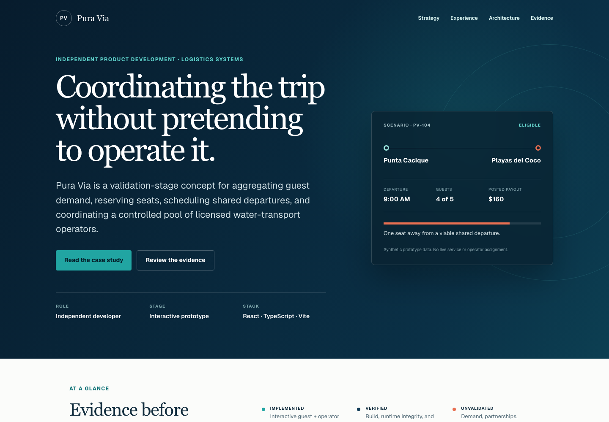

# Pura Via — technical product case study

[](https://github.com/stevefinston/pura-via-case-study/actions/workflows/ci.yml)

An evidence-led case study of how I translated a validation-stage shared
water-transport concept into explicit stakeholders, departure states, trust
boundaries, and working interactive prototypes.

**[View the published case study](https://pura-via-case-study.vercel.app)**



## What this demonstrates

- Product framing for a coordination problem with guests, concierges, and
  independent operators
- A departure state model that separates pending, confirmed, guaranteed, full,
  and canceled runs
- Guest-facing and private operator-dispatch surfaces with deliberately different
  information boundaries
- Interactive React and TypeScript prototypes using synthetic, date-neutral data
- Evidence-led communication that distinguishes design, implementation,
  automated verification, and unresolved validation

Pura Via is a **validation-stage coordination concept**. This repository does not
represent a launched transportation service, an operator or hotel partnership, a
live pilot, real bookings, revenue, or measured outcomes.

## The product decision

The central product move is to coordinate demand before treating a departure as
operational. A guest can express intent and watch a threshold progress without
being shown private operator information. A separate dispatch surface can expose
eligible runs, an individual synthetic payout, availability, and a structured
counteroffer without leaking those details back into the guest experience.

That boundary lets the prototype explore the hard parts of the workflow while
remaining honest about what has not yet been validated: demand density, operator
participation, price, unit economics, regulation, safety responsibilities, and
real-world operations.

## Technical shape

- React 19 and TypeScript
- Next-compatible application structure built with Vinext and Vite
- Responsive CSS without a component-library dependency
- Playwright browser coverage for desktop and mobile
- Automated accessibility checks with Axe
- GitHub Actions for lint, build, browser QA, and dependency audit

The production presentation is published on Vercel with indexable canonical and
social metadata. Local and preview environments remain `noindex`; this public
repository remains the canonical source for updates.

## Evidence and verification

The full claim inventory lives in [EVIDENCE.md](EVIDENCE.md). The local verification
record includes:

- 28 protected source-runtime files verified
- 4 of 4 source packaging checks passed
- 8 of 8 source browser-runtime checks passed
- 10 of 10 case-study browser checks passed across desktop and mobile
- Lint, production build, accessibility, keyboard, reduced-motion, navigation,
  metadata, and responsive-overflow checks passed
- Zero known vulnerabilities in the current dependency tree

These results verify the prototypes and case-study implementation. They do not
constitute proof of deployment, demand, legal approval, partner acceptance, or
business outcomes.

## Run and update locally

Requires Node.js 22.13 or newer.

```bash
npm ci
npm run dev
```

Before committing an update:

```bash
npm run lint
npm run build
npm run test:qa
npm audit --audit-level=high
```

See [docs/UPDATING.md](docs/UPDATING.md) for the content map, evidence rules, and
release boundaries. Copy the maintained title, description, and link from
[docs/LINKEDIN_FEATURED.md](docs/LINKEDIN_FEATURED.md) when adding the project to
LinkedIn Featured.

## Repository map

- `app/page.tsx` — public narrative and synthetic interface diagrams
- `app/globals.css` — responsive visual system
- `app/layout.tsx` — local-review metadata and social-preview configuration
- `public/og.png` — public-safe social-preview image
- `EVIDENCE.md` — claim-to-source evidence inventory and maturity boundaries
- `PUBLICATION_CHECKLIST.md` — privacy, QA, metadata, and release gates
- `tests/case-study.spec.ts` — browser and accessibility QA

Built independently by [Steven Finston](https://github.com/stevefinston).
